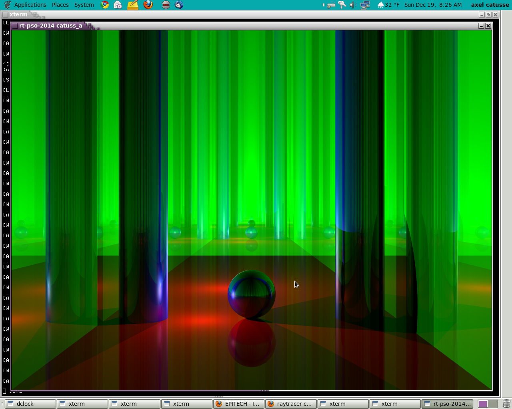

Raytracer
=========

ray tracing is a technique for generating an image by tracing the path of light through pixels in an image plane and simulating the effects of its encounters with virtual objects.

Features
=========

- Reflexion
- Specular
- Shadow
- Clustering
- Luminosity
- Class Object in XML
- Ambient light

and many others:

ScreeShot
=========

